## Montar uma Integração continua com AWS CodePipeline e AWS CodeDeploy

1. Em uma conta AWS entre no serviço ECR
   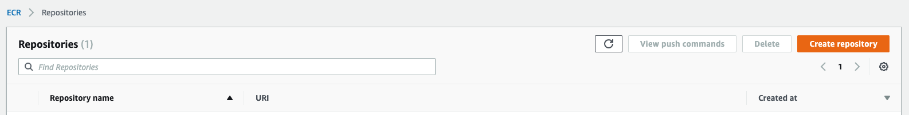
2. Clique em Create repository.
3. De o nome de express-app-testing-demo-img
   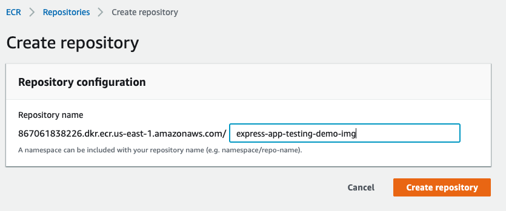
4. Baixe o repositório `18cld-cicd-aws` na branch `deploy-ecr` com o comando `git clone https://github.com/vamperst/18cld-cicd-aws.git && git fetch && git checkout deploy-ecr`
5. Entre no repositório bainxado com `cd 18cld-cicd-aws`
6. Crie um fork do repositorio para sua conta do github, ela que sera utilizada nos exemplos, não o repositório de onde baixou diretamente. Isso lhe dara mais liberdade de testes.
7. No console AWS vá para o Serviço CodePipeline.
   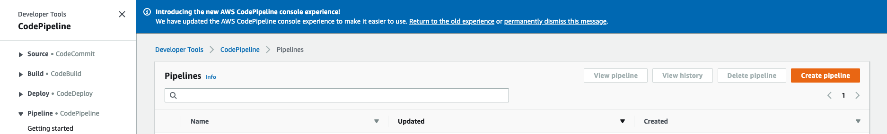
8. Clique em create pipeline
9. De o Nome de express-app-testing-demo-ci
10. Mantenha new service role selecionado e clique em next
    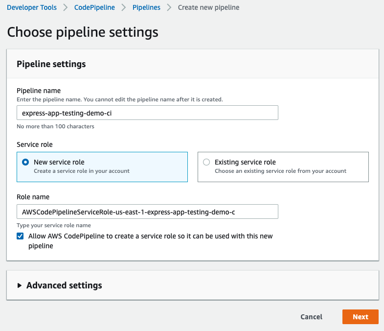
11. No source escolha git e efetue o login na sua conta.
12. Deixe as opções como na imagem
    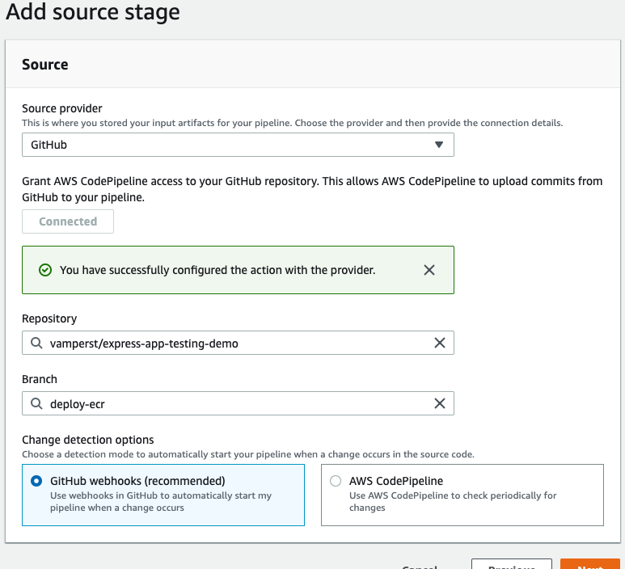
13. Na página seguinte escolha CodeBuild como provider.
14. Clique em create project
    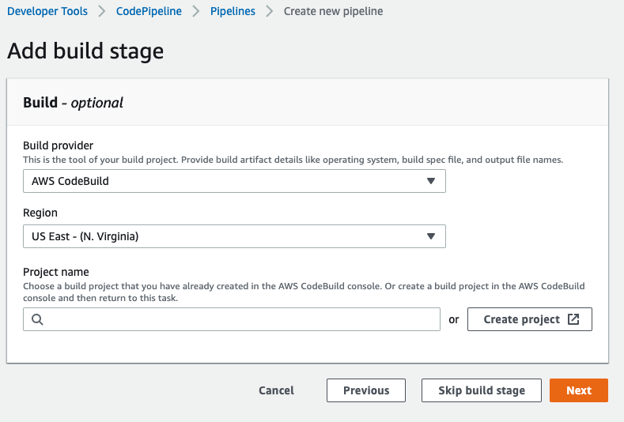
15. Na pagina que abrir coloque o nome do projeto 'express-app-testing-demo-build-image'
16. Em enviroment deixe como na imagem abaixo
    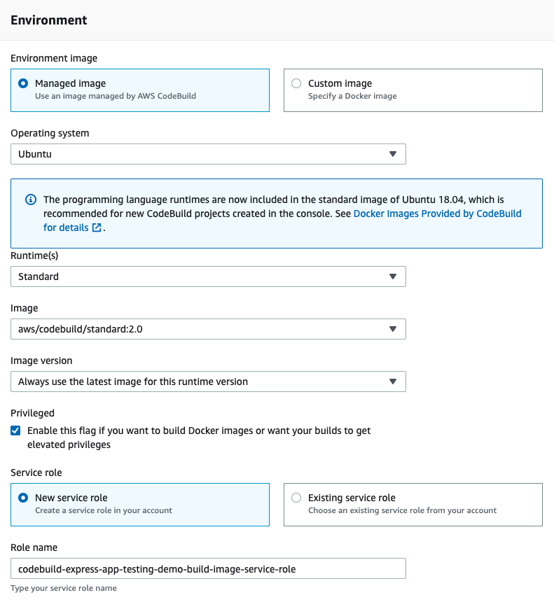
17. Ainda em environment cliqie em 'Additional information' para extender o menu, você irá adicionar 2 variaveis de ambiente: ECR_ADDRESS, com o link do ECR que criou no passo 3, e PROJECT_NAME com o texto 'express-app-testing-demo-prod'
    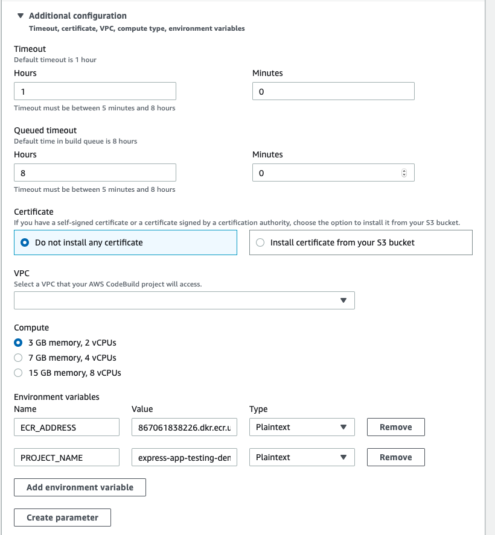
18. Em Buildspace apenas preencha com o nome do arquivo: 'buildspec.yml'
    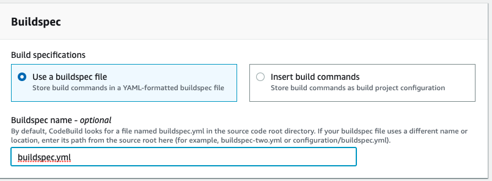
19. Clique em `continue do CodePipeline`ao final da página. Ele irá retornar a pagina do CodePipeline.
20. Clique em 'Next' na pagina do CodePipeline
    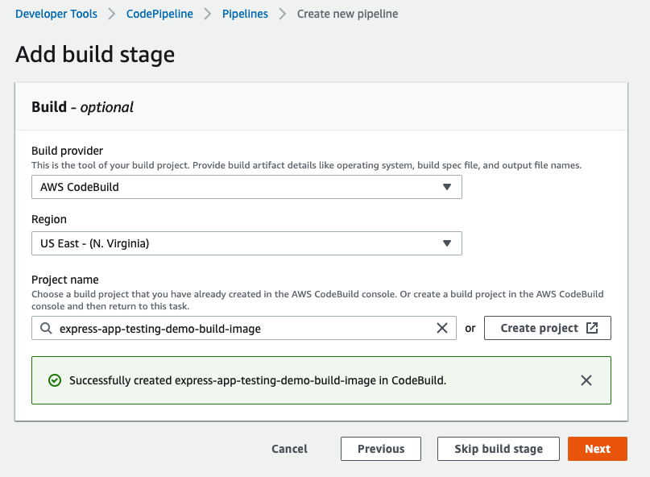
21. Clique em 'skip Deploy stage'
22. Revise e clique em `Create pipeline`
23. A primeira vez que rodar vai falhar porque a role não esta com a permissão correta no codebiuld. Vá para a tela do IAM em Roles (Funções) e ache a role digitando o nome do projeto 'express-app-testing-demo-build-image'. Clique na função.
    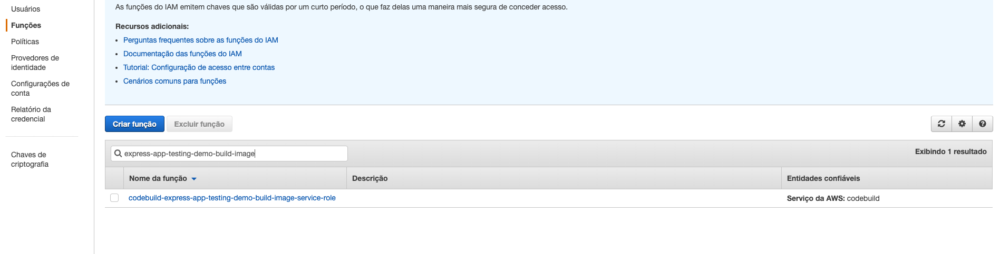
24. Clique em anexar politicas
25. Seleciona AdministratorAccess e anexe a politica
26. Volte ao CodePipeline e clique em 'Release Change' no canto superior direito
    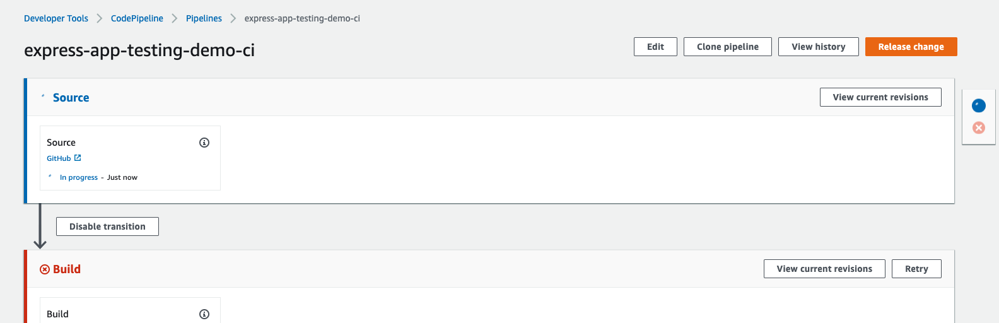
27. Você pode acompanhar os logs do build Clicando na fase quando ela estiver em andamento.
28. Após o termino você pode notar que os 2 estagios ficaram verdes e que tem uma nova imagem no repositório ECR.
    
    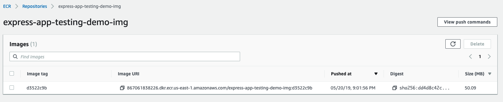
    