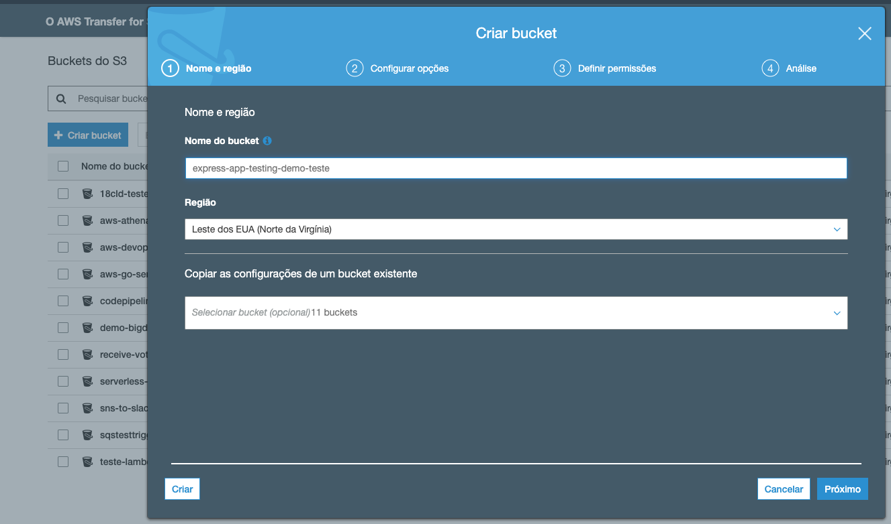
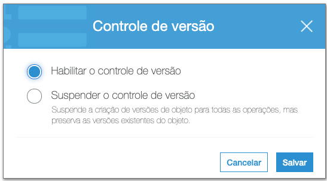
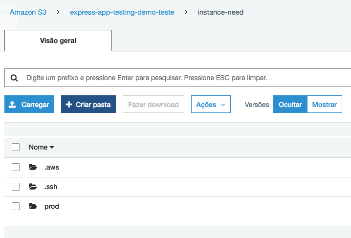
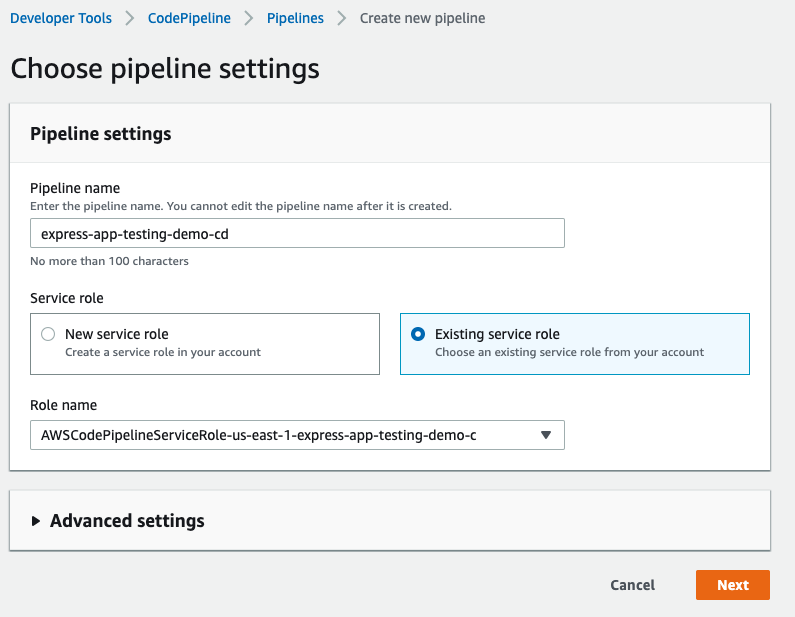
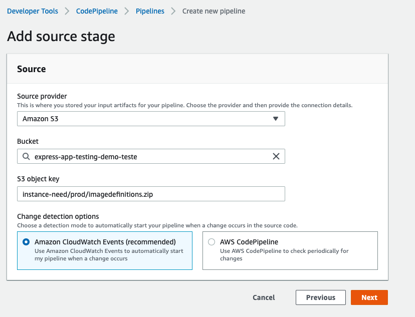
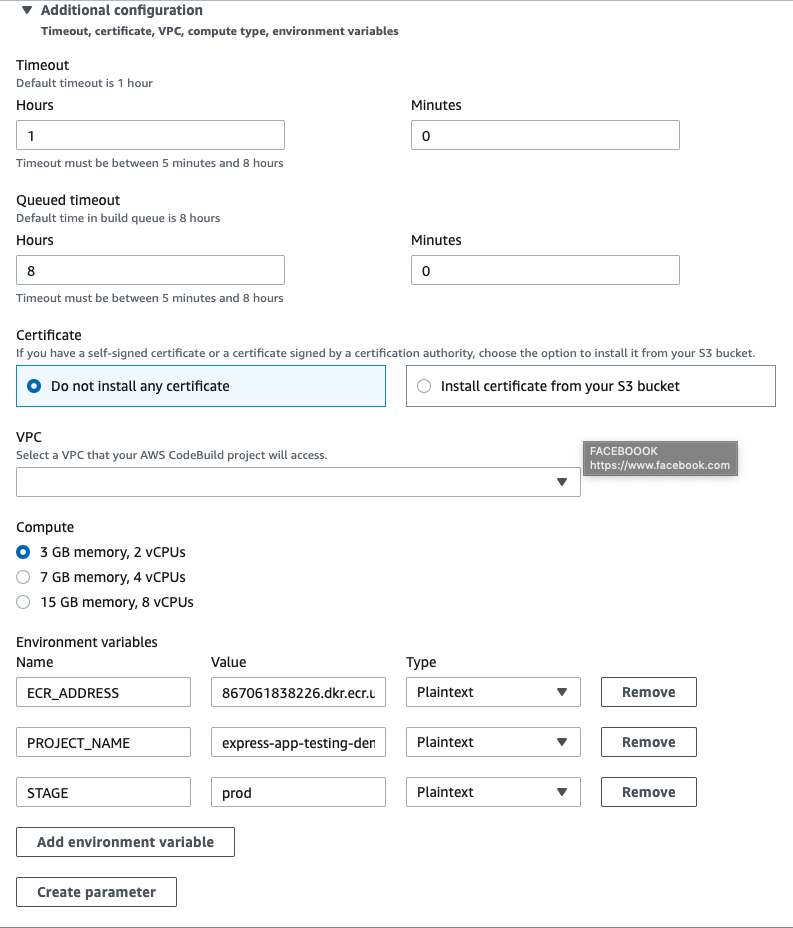
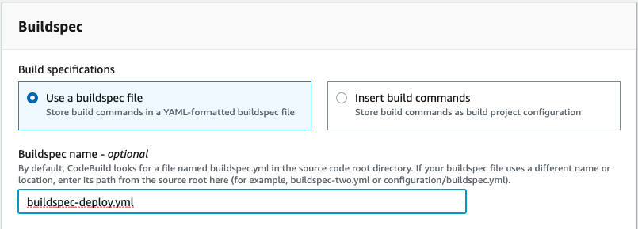
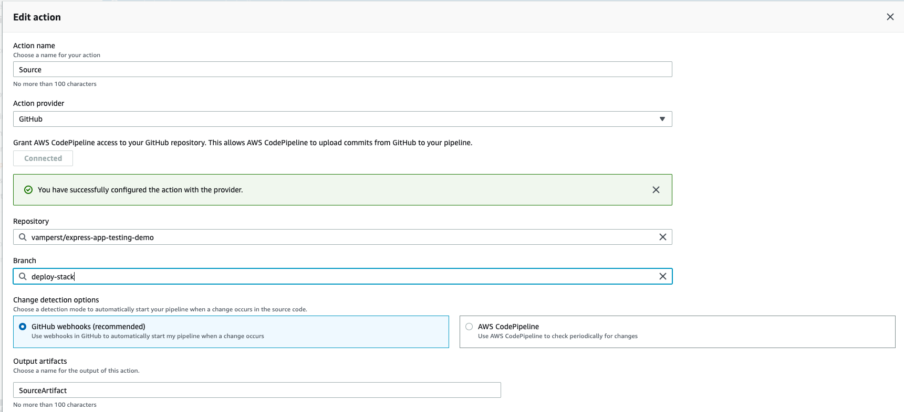
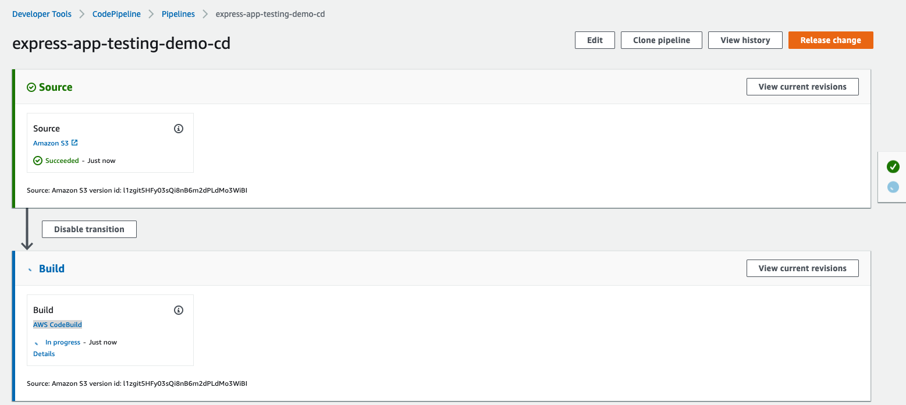
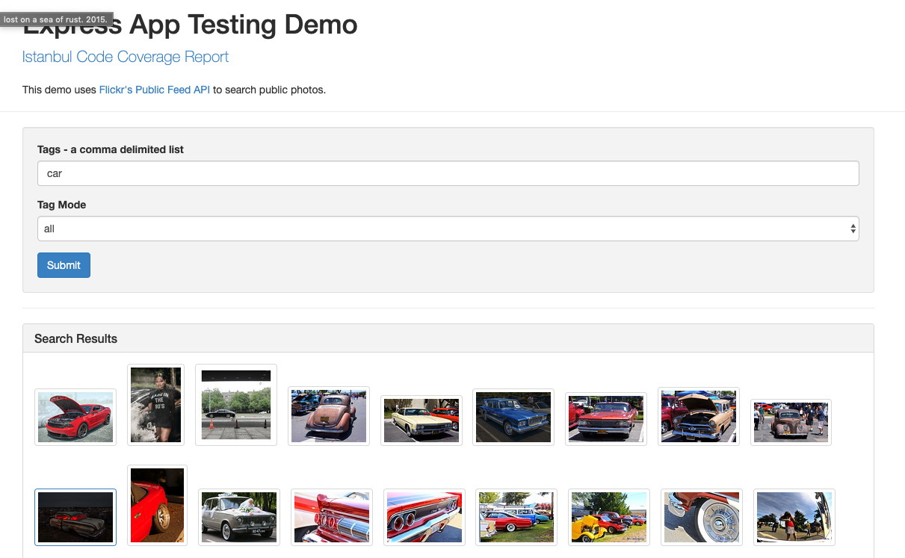

## Montar um delivery continua com AWS CodePipeline , AWS CodeDeploy, Terraform, e Docker

1. No console AWS crie um bucket S3 com o nome 'express-app-testing-demo-<NOME DIFERENCIANDO>'. Coloque no final o que quiser, vale lembrar que nomes de buckets são unicos em toda a AWS não só na conta em questão.
   
2. Após colocar o nome pode clicar direto em criar no canto inferior esquerdo.
3. Após criado, entre no bucket, vá na aba `Propriedades` e clique em `Controle de Versão`
4. Habilite essa propriedade para que o codePipeline possa identificar uma nova versão dos arquivos
   
5. Crie uma pasta no bucket com o nome 'instance-need'
   
6. Dentro da pasta recem criada crie 3 pastas
   1. `.ssh`
   2. `.aws`
   3. `prod`
   
7. Dentro da pasta .aws, coloque os arquivos `credentials` e `config` que estão na sua maquina virtual.
8. Dentro da pasta .ssh, coloque a pem criada para acessar as maquinas.
9. Não coloque nada dentro da pasta prod por enquanto.
10. Caso facilide, utilize comandos como esses direto da VM:
    ```
    aws s3 cp ~/.aws/config s3://express-app-testing-demo-teste/instance-need/.aws/config
    aws s3 cp ~/.aws/credentials s3://express-app-testing-demo-teste/instance-need/.aws/credentials
    aws s3 cp fiap-18cld.pem s3://express-app-testing-demo-teste/instance-need/.ssh/fiap-18cld.pem
    ```

    Só não esqueça de trocar o nome do bucket
11. Na maquina virtual vá até onde esta o projeto do git e executem o comando `git fetch && git checkout deploy-stack` para mudar a branch do repositório.
12. Dentro do arquivo `buildspec-deploy.yml` e `buildspec.yml` mude o nome dos buckets para o que criou. Procuro por S3 no arquivo para facilitar.
13. Dentro da pasta terraform, troque o nome do bucket do arquivo `state.tf`
14. Commit as mudanças e mande para o Git
15. De volta ao painel da AWS vamos criar mais um CodePipeline e CodeDeploy, dessa com source em S3. dessa vez coloque o nome 'express-app-testing-demo-cd' e usando a role criada para o outro pipeline.
    
16. Clique em next
17. Escolha o Source `Amazon S3`. Ache o seu bucket para selecionar, e na key coloque `instance-need/prod/imagedefinitions.zip`
    
18. Clique em next
19. Build Provider é o CodeBuild e crie um novo projeto como fez no pipeline anterior.
20. Na janela para criar o build. Coloque o nome `express-app-testing-demo-cd`. A parte de enviromnet fica igual a do exemplo anterior em questão de potencia e configuração das maquinas.
21. Esse build tem 3 variaveis de ambiente:
    1.  ECR_ADDRESS: com o endereço do ECR
    2.  PROJECT_NAME: Nome do projeto sendo feito
    3.  STAGE: qual o estagio desse build
    
22. Dessa vez o nome do buildspec é `buildspec-deploy.yml`.
    
23. Clique em 'continue to pipeline'
24. De volta a tela do pipeline clique em next.
25. Clique em `skip deploy stage`
26. Revise e crie o pipeline
27. Veja qual a role deste CodeDeploy e adicione o 'AdministratorAccess' no painel do IAM
28. No pipeline express-app-testing-demo-ci altere a branch monitorada para deploy-stack. Ao entrar no pipeline tem um botão editar no canto superior direito.
    
29. Se tudo der certo você já pode clicar em `Release change` no primeiro pipeline que criou.
30. Ao terminar o primeiro pipeline note que o segundo começa automaticamente.
    
31. Quando o processo terminar vá até o painel do Ec2 na parte de Load Balancers. Selecione o Load balancer criado e olhe na aba instancias se todas já estão em serviço(Esse processo de registro pode demorar um pouco, de refresh na página). 
32. Pegue o dns do load balancer e coloque no navegador para abrir o pesquisador do Flickr
    
33. Para destruir localmente a stack que foi feita pegue através da tag de uma das ec2 rodando a versão atual, e siga os comando abaixo.
    ``` bash
    terraform init
    terraform workspace select prod
    terraform destroy -var version=<VERSÃO DA TAG> -var stage=prod -auto-approve 
    ```
